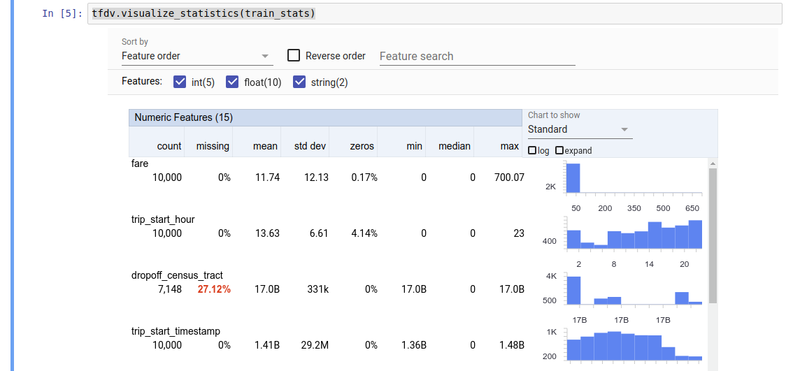

# How to solve data problems

@yuri-ferreira

Revision date: 08/07/2022

This document is a guideline for junior data scientists. When I started my career in a startup as an intern, I was full of energy and passion but did not have a lot of guidance. I had unclear goals, high expectations, and bad management. Solving problems without a handbook proved to be a nightmare!

Fortunately, not everyone has to face the same problems I have. This document will cover some insights and pain points I have learned so far! It's a step-by-step approach to solving data problems. I hope this will be helpful!

## 1) Understand the problem

It's not uncommon for data scientists to jump straight into data and modeling. Managers might ask for machine learning models even without knowing what they are. When these times arrive, you must take a step back and ask yourself: what am I trying to solve here? 

Sometimes the problem is very straightforward: such as predicting a default credit customer. Other times, you need to break your problem into smaller ones: for face recognition, you first need to identify a face and then match it with your database of faces. 

However, the problem is not well defined most of the time. You will have data scattered around, and it will be hard to figure things out. A good way to have insights is to look online for similar problems. The [kaggle community](https://www.kaggle.com/) is very helpful for these situations. 

Your solution should fit to the problem needs, not the other way around. It can be a machine learning model (or several ones), a dashboard or decision-making framework using your model. It all depends on your problem needs and your creativity!

  

## 2) Know your data

Data can come in many formats and flavors. It can be on SQL databases or a bunch of images. It's essential to dive deep into it. Often you will face some data issues, or your dataset might not be enough to answer your questions. Fortunately, there are techniques you can use, depending on the data format:

 - **Tables** - most of your data will be in tables. Sometimes in a single .csv file, sometimes in a database. You can use [pandas](https://pandas.pydata.org/) library to read and join these tables together.
Standard practice here is to conduct an extensive **Exploratory Data Analysis**: to see what variables are numerical, text, and what needs to be categorized. Analyze them and check for frequent values using histograms and boxplots. I recommend both  [seaborn](https://seaborn.pydata.org/) and [TensorFlow data validation](https://www.tensorflow.org/tfx/data_validation/get_started) python libraries for this task.	

 - **Images** - computer vision is a growing topic in the data science field. It's becoming more often that your data will be photos and pictures. You will need to answer other problems: are the images of the same shape (width x height)? Is the resolution always the same? Are the pictures clear, or is it too bright or dark? Can a human understand it? Do I have enough examples? Your model input needs to be consistent across all the samples! You will have to crop, resize and brighten your data. Using the' PIL' library, you can do it quickly and at scale.

 - **Mixed** - sometimes, your data combine tables, images, text, and audio. You can then apply the abovementioned techniques to each part of your data. Then you just need to join all the information in a single usable dataset (use pandas again)

## 3) Have a baseline

It is crucial to have a benchmark before the modeling phase. When you have a reference point, you can easily compare it to your ongoing results and experiments. This baseline can come in many forms:
 - **Previous model version** - your problem might be to increase an old model's accuracy or change its architecture. The old model can be used as a reliable benchmark.
 - **Human-Level Performance** - if you have professionals or specialists in the area, use them! For example, let's say the average doctor has an error rate of 3% for an image lung cancer diagnostic; use this as your baseline. Machines can be better at some tasks, but Human-Level Performance is a great reference overall.
 - **Quick implementation** - if you can't find a good benchmark, use your own! Create a simple and fast model with a few lines of code, and use it as your reference. It can be a simple linear regression without a lot of feature engineering.

## 4) Split your data

One final step before modeling is to split your data. The idea is to have unseen samples to validate your model later on. This way, you ensure that you are fairly testing your model against the benchmark. One way is to create 2 (or more) datasets with randomly selected samples. A handy tool is the [sklearn train test split function](https://scikit-learn.org/stable/modules/generated/sklearn.model_selection.train_test_split.html). A good proportion is 80% to the train and 20%, but this can vary depending of your sample size and data type.

  

## 5) Start to Model

Finally, you get to the fun part! Here is where most of us like to be: showing off our excellent data science skills through state-of-the-art AI models. 
 - **Feature Engineering** - After thoroughly analyzing your data and understanding the business, create new features with your insights. Linear models don't fully capture feature interactions, and you might need to make your variables for them to have good results. 
 - **Machine Learning Models** - You can try different techniques and libraries depending on your problem. You might try logistic regression, gradient boosting trees, random forests, and even neural networks for classification tasks. For images, you can use convolutional neural networks with different architectures.
 - **Ensemble** - combining different models can lead to an incredible accuracy increase. The ensemble technique is standard practice in many Kaggle competitions but might be too complex or challenging in the real world. Use it at your own risk!

## 6) Validate your model 

The final step is to measure the performance of your model. To do so, you can define your metric depending on the type of your task:
 - **Classification** - a good metric here is the [ROC-AUC](https://en.wikipedia.org/wiki/Receiver_operating_characteristic) score. It measures how well your model can separate the positive and negative classes. You can use the [sklearn ROC-AUC function](https://scikit-learn.org/stable/modules/generated/sklearn.metrics.roc_auc_score.htm) to measure it for both your training and test set easily. 

  

 - **Regression** - usually, people use the [R-squared metric](https://en.wikipedia.org/wiki/Coefficient_of_determination). It tells how much your model can predict the response variable using your variables. Again, [sklearn](https://scikit-learn.org/stable/modules/generated/sklearn.metrics.r2_score.html) is useful here

## In Conclusion

 - Understand the problem - Look for what you are trying to solve with your data
 - Know your data - take a deep dive and get some insights from it
 - Have a baseline - an easy benchmark for comparison later on
 - Split your data -  have different datasets for training and testing
 - Start to model - try modeling techniques
 - Validate your model - measure your model performance against the benchmark

And the essential task, have fun!

